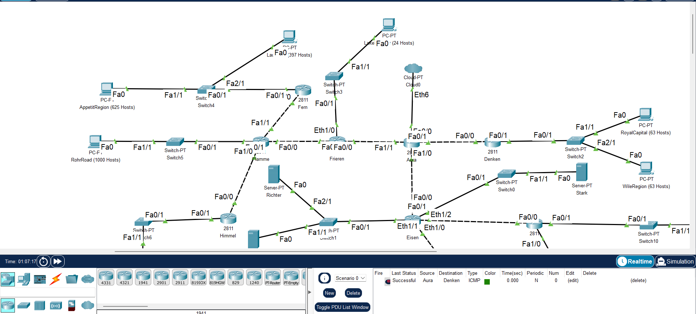

# Laporan Resmi Praktikum Jaringan Komputer Modul 4 - Subnetting & Routing
## Identitas Kelompok
| Nama                                 | NRP        |
| -------------------------------------|------------|
| Rayssa Ravelia                       | 5025211219 |

### Daftar Isi
- [Soal](#soal) <br/>
- [Jawaban](#jawab) <br/>
    - [a. Subnetting](#a-subnetting)
    - [b. Perhitungan IP](#b-perhitungan-ip)
        - [Metode 1: VLSM](#b1-metode-1-variable-length-subnet-masking-vlsm)
        - [Metode 2: CIDR](#b2-metode-2-classless-inter-domain-routing-cidr)
    - [c. Implementasi pembagian IP](#c-implementasi-pembagian-ip)
        - [VLSM di GNS3](#c1-konfigurasi-ip-vlsm-di-gns3)
        - [CIDR di CPT](#c2-konfigurasi-ip-cidr-di-cisco-packet-tracer)
    - [d. Routing IP](#d-routing-ip)
        - [Routing VLSM di GNS3](#d1-routing-ip-vlsm-di-gns3)
        - [Routing CIDR di CPT](#d2-routing-ip-cidr-di-cisco-packet-tracer)

## Soal


1. Soal shift dikerjakan pada Cisco Packet Tracer dan GNS3 menggunakan metode perhitungan CLASSLESS yang berbeda. <br />
Keterangan: Bila di CPT menggunakan VLSM, maka di GNS3 menggunakan CIDR atau sebaliknya
2. Jika tidak ada pemberitahuan revisi soal dari asisten, berarti semua soal BERSIFAT BENAR dan DAPAT DIKERJAKAN.
3. Untuk di GNS3 CLOUD merupakan NAT1 jangan sampai salah agar bisa terkoneksi internet.
4. Pembagian IP menggunakan Prefix IP yang telah ditentukan pada modul pengenalan
5. Pembagian IP dan routing harus SE-EFISIEN MUNGKIN.
6. Gambar topologi yang lebih jelas dapat diakses pada [link berikut](https://drive.google.com/file/d/1VmJXOyEoWru1tfXISOgoJiPfE1hpbptM/view?usp=sharing)

Hal yang perlu diperhatikan
1. Gunakan prefix IP sesuai dengan prefix IP masing-masing.
2. Terdapat [template](https://docs.google.com/spreadsheets/u/0/d/1JYXhktv0Kor4IpAlyZ8VvnnsnfKwRQJzfVpAoEguG94/edit) spreadsheet untuk mempermudah penilaian, gunakan template tersebut untuk melakukan penghitungan subnetting.
3. Hasil perhitungan subnetting dan pohon pembagian IP serta file .pkt di submit pada link di atas.
4. File yang didemokan adalah file .pkt yang telah disubmit
5. Pengurangan nilai akan dilakukan ketika:
    - Melanggar salah satu dari tulisan diatas.
    - Tidak menggunakan PREFIX ip yang ditetapkan sebelumnya
    - Hasil perhitungan untuk VLSM / CIDR, berbeda dengan di CPT / GNS3
    - Pembagian IP kurang efisien
    - Routing kurang efisien
    - Tidak bisa menjelaskan cara perhitungan VLSM dan CIDR

## Jawab
Untuk penjelasan pengerjaan praktikum ini adapun video demonstrasi di [link berikut](https://youtu.be/X3RqggdkLOY)


### A. Subnetting
Pertama-tama, kita harus melakukan subnetting pada topologi yang ada pada soal menggunakan metode classful. Berikut ini adalah tabel class yang terdapat di dalam metode Classful:

| Class  | Netmask | Jumlah Host |
|--------|---------|-------------|
| Class A | /8      | 16777216    |
| Class B | /16     | 65536       |
| Class C | /24     | 256         |

Dari kelas-kelas tersebut, Class A memiliki jumlah host terbesar, sementara Class C memiliki jumlah host terkecil.

Berdasarkan topologi pada soal terdapat banyak PC yang memiliki banyak host, maka dari itu untuk setiap subnet digunakan Class A.

Subnetting dilakukan dengan cara memperhatikan jumlah kaki pada setiap router yang ada dan node-node lain di sekitarnya. 

Berikut ini adalah hasil subnetting yang telah dilakukan:


Terdapat 21 subnet yang terbentuk dari A1 hingga A21. Urutan subnetting yang saya lakukan menggunakan urutan Depth First Search (DFS) yang berawal dari Router Aura dan mengikuti arah jarum jam (clockwise).

Adapun tabel subnet untuk setiap netmask length sebagai berikut:

*Tabel 1. Subnet*
| Addresses | Usable IPs | Length | Subnet Mask       | Wildcard       |
|-----------|------------|--------|-------------------|----------------|
| 1         | 1          | /32    | 255.255.255.255   | 0.0.0.0        |
| 2         | NA         | /31    | 255.255.255.254   | 0.0.0.1        |
| 4         | 2          | /30    | 255.255.255.252   | 0.0.0.3        |
| 8         | 6          | /29    | 255.255.255.248   | 0.0.0.7        |
| 16        | 14         | /28    | 255.255.255.240   | 0.0.0.15       |
| 32        | 30         | /27    | 255.255.255.224   | 0.0.0.31       |
| 64        | 62         | /26    | 255.255.255.192   | 0.0.0.63       |
| 128       | 126        | /25    | 255.255.255.128   | 0.0.0.127      |
| 256       | 254        | /24    | 255.255.255.0     | 0.0.0.255      |
| 512       | 510        | /23    | 255.255.254.0     | 0.0.1.255      |
| 1024      | 1022       | /22    | 255.255.252.0     | 0.0.3.255      |
| 2048      | 2046       | /21    | 255.255.248.0     | 0.0.7.255      |
| 4096      | 4094       | /20    | 255.255.240.0     | 0.0.15.255     |
| 8192      | 8190       | /19    | 255.255.224.0     | 0.0.31.255     |
| 16384     | 16382      | /18    | 255.255.192.0     | 0.0.63.255     |
| 32768     | 32766      | /17    | 255.255.128.0     | 0.0.127.255    |
| 65536     | 65534      | /16    | 255.255.0.0       | 0.0.255.255    |
| 131072    | 131070     | /15    | 255.254.0.0       | 0.1.255.255    |
| 262144    | 262142     | /14    | 255.252.0.0       | 0.3.255.255    |
| 524288    | 524286     | /13    | 255.248.0.0       | 0.7.255.255    |
| 1048576   | 1048574    | /12    | 255.240.0.0       | 0.15.255.255   |
| 2097152   | 2097150    | /11    | 255.224.0.0       | 0.31.255.255   |
| 4194304   | 4194302    | /10    | 255.192.0.0       | 0.63.255.255   |
| 8388608   | 8388606    | /9     | 255.128.0.0       | 0.127.255.255  |
| 16777216  | 16777214   | /8     | 255.0.0.0         | 0.255.255.255  |


Berikut ini adalah tabel rute topologi berdasarkan subnetting yang telah dilakukan dan Subnet Mask diperoleh dari tabel subnet sebelumnya:

*Tabel 2. Rute topologi subnetting*
| Nama Subnet | Rute                                                  | Jumlah IP | Netmask Length | Subnet Mask       |
|-------------|-------------------------------------------------------|-----------|----------------|-------------------|
| A1          | Aura - Denken                                         | 2         | /30            | 255.255.255.252   |
| A2          | Denken - Switch2 - RoyalCapital - Switch2 - WilleRegion | 127       | /24            | 255.255.255.0     |
| A3          | Aura - Eisen                                          | 2         | /30            | 255.255.255.252   |
| A4          | Eisen - Switch0 - Stark                               | 2         | /30            | 255.255.255.252   |
| A5          | Eisen - Lugner                                        | 2         | /30            | 255.255.255.252   |
| A6          | Lugner - Switch10 - TurkRegion                        | 1001      | /22            | 255.255.252.0     |
| A7          | Lugner - Switch9 - GrobeForest                        | 251       | /24            | 255.255.255.0     |
| A8          | Eisen - Linie                                         | 2         | /30            | 255.255.255.252   |
| A9          | Linie - Switch11 - GranzChannel                       | 255       | /23            | 255.255.254.0     |
| A10         | Linie - Lawine                                        | 2         | /30            | 255.255.255.252   |
| A11         | Lawine - Switch7 - Heiter - Switch7 - BredtRegion     | 31        | /26            | 255.255.255.192   |
| A12         | Heiter - Switch8 - RiegelCanyon - Switch8 - Sein      | 512       | /22            | 255.255.252.0     |
| A13         | Eisen - Switch1 - Revolte - Switch1 - Richter         | 3         | /29            | 255.255.255.248   |
| A14         | Aura - Frieren                                        | 2         | /30            | 255.255.255.252   |
| A15         | Frieren - Flamme                                      | 2         | /30            | 255.255.255.252   |
| A16         | Flamme - Himmel                                       | 2         | /30            | 255.255.255.252   |
| A17         | Himmel - Switch6 - SchewerMountains                   | 6         | /29            | 255.255.255.248   |
| A18         | Flamme - Switch5 - RohrRoad                           | 1001      | /22            | 255.255.252.0     |
| A19         | Flamme - Fern                                         | 2         | /30            | 255.255.255.252   |
| A20         | Fern - Switch4 - AppetitRegion - Switch4 - LaubHills  | 1023      | /21            | 255.255.248.0     |
| A21         | Frieren - Switch3 - LakeKorridor                      | 25        | /27            | 255.255.255.224   |
| Total       |                                                       | 4255      | /19            | 255.255.224.0     |


### B. Perhitungan IP 

#### B.1. Metode 1: Variable Length Subnet Masking (VLSM)
Variable Length Subnet Masking (VLSM) adalah metode untuk membagi blok IP address menjadi beberapa subnet dengan ukuran yang berbeda-beda, sesuai dengan kebutuhan nyata dari jaringan yang akan menggunakan alamat-alamat tersebut. Berbeda dengan subnetting tradisional yang menggunakan ukuran subnet yang seragam, VLSM memungkinkan penggunaan masker subnet dengan panjang yang variabel, sehingga lebih efisien dan fleksibel. 

##### B.1.1. Tree VLSM
Untuk melakukan perhitungan IP metode VLSM, kita harus membuat tree VLSM terlebih dahulu yang berdasarkan tabel 2. Untuk major network yang digunakan adalah `192.180.0.0/19` yang dimana `192.180` merupakan Prefix IP kelompok saya dan `/19` diperoleh dari subnet mask yang mencukupi topologi tersebut berdasarkan total IP pada tabel 2. 

Major network yang digunakan adalah `192.180.0.0/19` bukan `192.180.1.0/19` sebab `/19` menunjukkan bahwa 19 bit pertama dari alamat IP adalah netmask yang menentukan network identifier. Dalam hal ini, netmasknya adalah `255.255.224.0`, yang berarti bahwa alamat jaringan harus memiliki 19 bit pertama yang sama dan sisanya boleh berbeda. 

Alamat 192.180.0.0 secara implisit memiliki 19 bit pertama yang sama dan sisanya adalah nol, yang sesuai dengan definisi alamat jaringan dalam subnetting. Sebaliknya, alamat `192.180.1.0/19` salah dianggap sebagai alamat jaringan karena bit ke-17 dan ke-18 (dalam format biner) berubah dari 00 (dalam 192.180.0.0) menjadi 01, yang berarti alamat tersebut bukanlah permulaan dari blok alamat yang ditentukan oleh netmask /19 tetapi sebenarnya sebuah alamat host dalam blok alamat tersebut. Dalam subnetting, alamat jaringan harus memiliki semua host bits diatur ke nol, dan `192.180.1.0` tidak memenuhi kriteria ini jika netmasknya adalah `/19`.

Untuk membuat tree, kita harus berbasis dari tabel 1 dan tabel 2. Major IP memiliki netmask length `/19` yang berarti memiliki address sebesar `8122` berdasarkan tabel 1. Selanjutnya, major IP tersebut dipecah menjadi 2 bagian sehingga menjadi `192.180.0.0/20` dan `192.180.16.0/20`. IP `192.180.16.0/20` diperoleh dari `192.180.0.0/20`ditambah dengan banyaknya address untuk `/20`yaitu 4096 sehingga diperoleh `192.180.16.0/20`. Langkah ini diulangi terus menerus sehingga didapatkan IP sesuai dengan jumlah yang diinginkan pada tabel 2. 

Berikut ini adalah tree VLSM yang telah dibuat:


Pada tree yang saya buat selalu memecah bagian kiri terlebih dahulu agar perhitungan menjadi lebih mudah. 

##### B.1.2. Pembagian IP VLSM
Berdasarkan tree tersebut sudah didapatkan IP untuk 21 subnet yang ada. Maka kita dapat membuat tabel IP VLSM berdasarkan urutan subnet mask terbesar sebagai berikut:

*Tabel 3. IP VLSM berdarkan subnet size terbesar*
| Subnet Name | Subnet Size | Allocated Size | Address        | Mask | Dec Mask        | Assignable Range          | Broadcast       |
|-------------|-------------|----------------|----------------|------|-----------------|---------------------------|-----------------|
| A20         | 1023        | 2046           | 192.180.0.0    | /21  | 255.255.248.0   | 192.180.0.1 - 192.180.7.254   | 192.180.7.255   |
| A18         | 1001        | 1022           | 192.180.8.0    | /22  | 255.255.252.0   | 192.180.8.1 - 192.180.11.254  | 192.180.11.255  |
| A6          | 1001        | 1022           | 192.180.12.0   | /22  | 255.255.252.0   | 192.180.12.1 - 192.180.15.254 | 192.180.15.255  |
| A12         | 512         | 1022           | 192.180.16.0   | /22  | 255.255.252.0   | 192.180.16.1 - 192.180.19.254 | 192.180.19.255  |
| A9          | 255         | 510            | 192.180.20.0   | /23  | 255.255.254.0   | 192.180.20.1 - 192.180.21.254 | 192.180.21.255  |
| A7          | 251         | 254            | 192.180.22.0   | /24  | 255.255.255.0   | 192.180.22.1 - 192.180.22.254 | 192.180.22.255  |
| A2          | 127         | 254            | 192.180.23.0   | /24  | 255.255.255.0   | 192.180.23.1 - 192.180.23.254 | 192.180.23.255  |
| A11         | 31          | 62             | 192.180.24.0   | /26  | 255.255.255.192 | 192.180.24.1 - 192.180.24.62   | 192.180.24.63   |
| A21         | 25          | 30             | 192.180.24.64  | /27  | 255.255.255.224 | 192.180.24.65 - 192.180.24.94  | 192.180.24.95   |
| A17         | 6           | 6              | 192.180.24.96  | /29  | 255.255.255.248 | 192.180.24.97 - 192.180.24.102 | 192.180.24.103  |
| A13         | 3           | 6              | 192.180.24.104 | /29  | 255.255.255.248 | 192.180.24.105 - 192.180.24.110 | 192.180.24.111  |
| A1          | 2           | 2              | 192.180.24.112 | /30  | 255.255.255.252 | 192.180.24.113 - 192.180.24.114 | 192.180.24.115  |
| A10         | 2           | 2              | 192.180.24.116 | /30  | 255.255.255.252 | 192.180.24.117 - 192.180.24.118 | 192.180.24.119  |
| A14         | 2           | 2              | 192.180.24.120 | /30  | 255.255.255.252 | 192.180.24.121 - 192.180.24.122 | 192.180.24.123  |
| A15         | 2           | 2              | 192.180.24.124 | /30  | 255.255.255.252 | 192.180.24.125 - 192.180.24.126 | 192.180.24.127  |
| A16         | 2           | 2              | 192.180.24.128 | /30  | 255.255.255.252 | 192.180.24.129 - 192.180.24.130 | 192.180.24.131  |
| A19         | 2           | 2              | 192.180.24.132 | /30  | 255.255.255.252 | 192.180.24.133 - 192.180.24.134 | 192.180.24.135  |
| A3          | 2           | 2              | 192.180.24.136 | /30  | 255.255.255.252 | 192.180.24.137 - 192.180.24.138 | 192.180.24.139  |
| A4          | 2           | 2              | 192.180.24.140 | /30  | 255.255.255.252 | 192.180.24.141 - 192.180.24.142 | 192.180.24.143  |
| A5          | 2           | 2              | 192.180.24.144 | /30  | 255.255.255.252 | 192.180.24.145 - 192.180.24.146 | 192.180.24.147  |
| A8          | 2           | 2              | 192.180.24.148 | /30  | 255.255.255.252 | 192.180.24.149 - 192.180.24.150 | 192.180.24.151  |

Pada tabel di atas, assignable range diperoleh dari subnet size yang dibutuhkan dan allocated size yang disediakan oleh netmask length, address (NID) diperoleh dari IP yang telah didapatkan pada tree, mask dan dec mask diperoleh dari tabel 1 sesuai dengan subnet name yang berkoresponden, dan broadcast adalah IP terakhir setelah range dari assignable range.

Adapun tabel IP VLSM berdasarkan urutan subnet sebagai berikut:

*Tabel 4. IP VLSM berdasarkan urutan subnet*
| Subnet | Network ID      | Netmask         | Broadcast       |
|--------|-----------------|-----------------|-----------------|
| A1     | 192.180.24.112  | 255.255.255.252 | 192.180.24.115  |
| A2     | 192.180.23.0    | 255.255.255.0   | 192.180.23.255  |
| A3     | 192.180.24.136  | 255.255.255.252 | 192.180.24.139  |
| A4     | 192.180.24.140  | 255.255.255.252 | 192.180.24.143  |
| A5     | 192.180.24.144  | 255.255.255.252 | 192.180.24.147  |
| A6     | 192.180.12.0    | 255.255.252.0   | 192.180.15.255  |
| A7     | 192.180.22.0    | 255.255.255.0   | 192.180.22.255  |
| A8     | 192.180.24.148  | 255.255.255.252 | 192.180.24.151  |
| A9     | 192.180.20.0    | 255.255.254.0   | 192.180.21.255  |
| A10    | 192.180.24.116  | 255.255.255.252 | 192.180.24.119  |
| A11    | 192.180.24.0    | 255.255.255.192 | 192.180.24.63   |
| A12    | 192.180.16.0    | 255.255.252.0   | 192.180.19.255  |
| A13    | 192.180.24.104  | 255.255.255.248 | 192.180.24.111  |
| A14    | 192.180.24.120  | 255.255.255.252 | 192.180.24.123  |
| A15    | 192.180.24.124  | 255.255.255.252 | 192.180.24.127  |
| A16    | 192.180.24.128  | 255.255.255.252 | 192.180.24.131  |
| A17    | 192.180.24.96   | 255.255.255.248 | 192.180.24.103  |
| A18    | 192.180.8.0     | 255.255.252.0   | 192.180.11.255  |
| A19    | 192.180.24.132  | 255.255.255.252 | 192.180.24.135  |
| A20    | 192.180.0.0     | 255.255.248.0   | 192.180.7.255   |
| A21    | 192.180.24.64   | 255.255.255.224 | 192.180.24.95   |

#### B.2. Metode 2: Classless Inter-Domain Routing (CIDR)
Classless Inter-Domain Routing (CIDR) adalah sebuah skema pengalamatan dan routing yang ditujukan untuk membuat alokasi alamat IP menjadi lebih fleksibel dan efisien. CIDR menggantikan sistem pengalamatan berbasis kelas yang lebih lama, memungkinkan pembagiannya menjadi potongan yang lebih kecil dan berbagai ukuran, yang disesuaikan dengan kebutuhan spesifik jaringan. 

Untuk membuat CIDR kita harus melakukan penggabungan antar dua node yang dimulai dari node paling jauh dari cloud. 

Pertama-tama, kita harus melengkapi topologi subnetting yang telah dilakukan dengan menambahkan detail netmask length setiap subnet (berdasarkan tabel 2) sebagai berikut:


Sebelum melakukan penggabungan, kita lakukan dulu perhitungan masing-masing endpoint terhadap jarak ke Router Aura


Dari gambar tersebut, dapat dilihat bahwa A12 nemiliki jarak terjauh dengan jarak 4, yang diikuti dengan A17 dan A11 dengan jarak 3.

##### B.2.1. Penggabungan Pertama
Untuk penggabungan pertama dilakukan penggabungan sebagai berikut:


Hasil penggabungan pertama dimulai dengan index B yang menandakan merupakan hasil penggabungan dari subnet index berawalan A. Penggabungan pertama dipilih berdasarkan yang memiliki jarak terjauh dari cloud.

*Tabel 5. CIDR Gabungan Pertama*
| Subnet Gabungan | Subnet 1 | Netmask 1 | Subnet 2 | Netmask 2 | Netmask Akhir |
|-----------------|----------|-----------|----------|-----------|---------------|
| B1              | A11      | /26       | A12      | /22       | /21           |
| B2              | A16      | /30       | A17      | /29       | /28           |
| B3              | A19      | /30       | A20      | /21       | /20           |
| B4              | A6       | /22       | A7       | /24       | /21           |


Dari penggabungan pertama terbentuk B1, B2, B3, dan B4.

##### B.2.2. Penggabungan Kedua
Selanjutnya, lakukan perhitungan jarak kembali dari endpoint subnet yang baru sebagai berikut:


Berdasarkan gambar tersebut, yang memiliki jarak terjauh adalah B1 dengan jarak 3. Kita dapat melakukan penggabungan kedua sebagai berikut yang didasarkan dari jarak terjauh:


Hasil penggabungan kedua dimulai dengan index C yang menandakan merupakan hasil penggabungan kedua.

*Tabel 6. CIDR Gabungan Kedua*
| Subnet Gabungan | Subnet 1 | Netmask 1 | Subnet 2 | Netmask 2 | Netmask Akhir |
|-----------------|----------|-----------|----------|-----------|---------------|
| C1              | B1       | /21       | A10      | /30       | /20           |
| C2              | A18      | /22       | B3       | /20       | /19           |

Dari penggabungan kedua terbentuk C1 dan C2.

##### B.2.3. Penggabungan Ketiga
Selanjutnya, lakukan perhitungan jarak kembali dari endpoint subnet yang baru sebagai berikut:


Berdasarkan gambar tersebut, yang memiliki jarak terjauh adalah B4,A9,C1,B2, dan C2 dengan jarak 2. Kita dapat melakukan penggabungan ketiga sebagai berikut yang didasarkan dari jarak terjauh:


Hasil penggabungan ketiga dimulai dengan index D yang menandakan merupakan hasil penggabungan ketiga.

*Tabel 7. CIDR Gabungan Ketiga*
| Subnet Gabungan | Subnet 1 | Netmask 1 | Subnet 2 | Netmask 2 | Netmask Akhir |
|-----------------|----------|-----------|----------|-----------|---------------|
| D1              | B4       | /21       | A5       | /30       | /20           |
| D2              | A9       | /23       | C1       | /20       | /19           |
| D3              | B2       | /28       | C2       | /19       | /18           |

Dari penggabungan ketiga terbentuk D1, D2, dan D3.

##### B.2.4. Penggabungan Keempat
Selanjutnya, lakukan perhitungan jarak kembali dari endpoint subnet yang baru sebagai berikut:


Berdasarkan gambar tersebut, yang memiliki jarak terjauh adalah D2 dan D3 dengan jarak 2. Kita dapat melakukan penggabungan keempat sebagai berikut yang didasarkan dari jarak terjauh:


Hasil penggabungan keempat dimulai dengan index E yang menandakan merupakan hasil penggabungan keempat.

*Tabel 8. CIDR Gabungan Keempat*
| Subnet Gabungan | Subnet 1 | Netmask 1 | Subnet 2 | Netmask 2 | Netmask Akhir |
|-----------------|----------|-----------|----------|-----------|---------------|
| E1              | D2       | /19       | A8       | /30       | /18           |
| E2              | A15      | /30       | D3       | /18       | /17           |

Dari penggabungan keempat terbentuk E1 dan E2.

##### B.2.5. Penggabungan Kelima
Selanjutnya, lakukan perhitungan jarak kembali dari endpoint subnet yang baru sebagai berikut:


Berdasarkan gambar tersebut, semua subnet sudah memiliki jarak yang sama, yaitu sebesar 1. Maka untuk penggabungan kelima dilakukan sebagai berikut:


Hasil penggabungan kelima dimulai dengan index F yang menandakan merupakan hasil penggabungan kelima.

*Tabel 9. CIDR Gabungan Kelima*
| Subnet Gabungan | Subnet 1 | Netmask 1 | Subnet 2 | Netmask 2 | Netmask Akhir |
|-----------------|----------|-----------|----------|-----------|---------------|
| F1              | A13      | /29       | E1       | /18       | /17           |
| F2              | A4       | /30       | D1       | /20       | /19           |
| F3              | A14      | /30       | A21      | /27       | /26           |

Dari penggabungan kelima terbentuk F1, F2, dan F3.

##### B.2.6. Penggabungan Keenam
Sebab jarak endpoint terjauh sudah sama untuk setiap node, untuk penggabungan subnet keenam saya lakukan sebagai berikut:


Hasil penggabungan keenam dimulai dengan index G yang menandakan merupakan hasil penggabungan keenam.

*Tabel 10. CIDR Gabungan Keenam*
| Subnet Gabungan | Subnet 1 | Netmask 1 | Subnet 2 | Netmask 2 | Netmask Akhir |
|-----------------|----------|-----------|----------|-----------|---------------|
| G1              | A1       | /30       | A2       | /24       | /23           |
| G2              | A3       | /30       | F2       | /19       | /18           |

Dari penggabungan keenam terbentuk G1 dan G2.

##### B.2.7. Penggabungan Ketujuh
Untuk penggabungan ketujuh, dilakukan sebagai berikut:


Hasil penggabungan ketujuh dimulai dengan index H yang menandakan merupakan hasil penggabungan ketujuh.

*Tabel 11. CIDR Gabungan Ketujuh*
| Subnet Gabungan | Subnet 1 | Netmask 1 | Subnet 2 | Netmask 2 | Netmask Akhir |
|-----------------|----------|-----------|----------|-----------|---------------|
| H1              | G1       | /23       | G2       | /18       | /17           |

Dari penggabungan ketujuh terbentuk H1.

##### B.2.8. Penggabungan Kedelapan
Untuk penggabungan kedelapan, dilakukan sebagai berikut:


Hasil penggabungan kedelapan dimulai dengan index I yang menandakan merupakan hasil penggabungan kedelapan.

*Tabel 12. CIDR Gabungan Kedelapan*
| Subnet Gabungan | Subnet 1 | Netmask 1 | Subnet 2 | Netmask 2 | Netmask Akhir |
|-----------------|----------|-----------|----------|-----------|---------------|
| I1              | H1       | /17       | F3       | /26       | /16           |

Dari penggabungan kedelapan terbentuk I1.

##### B.2.9. Penggabungan Kesembilan
Untuk penggabungan kesembilan, dilakukan sebagai berikut:


Hasil penggabungan kesembilan dimulai dengan index J yang menandakan merupakan hasil penggabungan kesembilan.

*Tabel 13. CIDR Gabungan Kesembilan*
| Subnet Gabungan | Subnet 1 | Netmask 1 | Subnet 2 | Netmask 2 | Netmask Akhir |
|-----------------|----------|-----------|----------|-----------|---------------|
| J1              | F1       | /17       | I1       | /16       | /15           |

Dari penggabungan kesembilan terbentuk J1.

##### B.2.10. Penggabungan Kesepuluh
Untuk penggabungan kesepuluh, dilakukan sebagai berikut:


Hasil penggabungan kesepuluh dimulai dengan index K yang menandakan merupakan hasil penggabungan kesepuluh.

*Tabel 14. CIDR Gabungan Kesepuluh*
| Subnet Gabungan | Subnet 1 | Netmask 1 | Subnet 2 | Netmask 2 | Netmask Akhir |
|-----------------|----------|-----------|----------|-----------|---------------|
| K1              | E2       | /17       | J1       | /15       | /14           |

Dari penggabungan kesepuluh terbentuk K1. Pada penggabungan ini, semua subnet sudah tergabung menjadi satu dengan netmask length /14.

##### B.2.11. Tree CIDR
Setelah kita mendapatkan netmask length akhir (/14), maka untuk menentukan IP kita perlu untuk membuat tree CIDR dengan major IP `192.180.0.0` yang memiliki netmask length `/14`. Major IP tersebut adalah subnet K1 yang kemudian dipecah menjadi dua sesuai dengan proses penggabungan subnet yang telah dilakukan, maka K1 dipecah menjadi E2 dan J1 sesuai dengan tabel 14. Proses ini dilakukan berkali-kali hinggal diperoleh A1 hingga A21.

Untuk perhitungan IP setiap pemecahan yang terjadi dilakukan sama seperti dalam tree VLSM, yang dimana menambahkan IP awal pecahan dengan jumlah address yang tersedia pada tabel 1. Sesuaikan IP dengan netmask length yang diminta untuk setiap subnet.

Berikut ini adalah hasil tree CIDR yang telah saya buat:


Pada tree yang saya buat, saya hanya menampilkan tree sesuai dengan penggabungan subnet yang dilakukan, tanpa memasukkan proses perhitungan untuk mendapatkan IP. Hal ini dikarenakan untuk mempermudah visualisasi data dalam tree.

##### B.2.12. Pembagian IP CIDR
Berdasarkan tree tersebut, berikut ini adalah IP CIDR berdasarkan hierarki tree.

*Tabel 15. IP CIDR berdasarkan hierarki tree*
| Subnet Name | Needed Size | Allocated Size | Address       | Mask | Dec Mask       | Assignable Range               | Broadcast       |
|-------------|-------------|----------------|---------------|------|----------------|--------------------------------|-----------------|
| J1          | 131070      | 131070         | 192.180.0.0   | /15  | 255.254.0.0    | 192.180.0.1 - 192.181.255.254  | 192.181.255.255 |
| E2          | 32766       | 32766          | 192.182.0.0   | /17  | 255.255.128.0  | 192.182.0.1 - 192.182.127.254  | 192.182.127.255 |
| D3          | 16382       | 16382          | 192.182.0.0   | /18  | 255.255.192.0  | 192.182.0.1 - 192.182.63.254   | 192.182.63.255  |
| A15         | 2           | 2              | 192.182.64.0  | /30  | 255.255.255.252| 192.182.64.1 - 192.182.64.2    | 192.182.64.3    |
| C2          | 8190        | 8190           | 192.182.0.0   | /19  | 255.255.224.0  | 192.182.0.1 - 192.182.31.254   | 192.182.31.255  |
| B2          | 14          | 14             | 192.182.32.0  | /28  | 255.255.255.240| 192.182.32.1 - 192.182.32.14   | 192.182.32.15   |
| A17         | 6           | 6              | 192.182.32.0  | /29  | 255.255.255.248| 192.182.32.1 - 192.182.32.6    | 192.182.32.7    |
| A16         | 2           | 2              | 192.182.32.8  | /30  | 255.255.255.252| 192.182.32.9 - 192.182.32.10   | 192.182.32.11   |
| B3          | 4094        | 4094           | 192.182.0.0   | /20  | 255.255.240.0  | 192.182.0.1 - 192.182.15.254   | 192.182.15.255  |
| A18         | 1022        | 1022           | 192.182.16.0  | /22  | 255.255.252.0  | 192.182.16.1 - 192.182.19.254  | 192.182.19.255  |
| A20         | 2046        | 2046           | 192.182.0.0   | /21  | 255.255.248.0  | 192.182.0.1 - 192.182.7.254    | 192.182.7.255   |
| A19         | 2           | 2              | 192.182.8.0   | /30  | 255.255.255.252| 192.182.8.1 - 192.182.8.2      | 192.182.8.3     |
| I1          | 65534       | 65534          | 192.180.0.0   | /16  | 255.255.0.0    | 192.180.0.1 - 192.180.255.254  | 192.180.255.255 |
| F1          | 32766       | 32766          | 192.181.0.0   | /17  | 255.255.128.0  | 192.181.0.1 - 192.181.127.254  | 192.181.127.255 |
| E1          | 16382       | 16382          | 192.181.0.0   | /18  | 255.255.192.0  | 192.181.0.1 - 192.181.63.254   | 192.181.63.255  |
| A13         | 6           | 6              | 192.181.64.0  | /29  | 255.255.255.248| 192.181.64.1 - 192.181.64.6    | 192.181.64.7    |
| D2          | 8190        | 8190           | 192.181.0.0   | /19  | 255.255.224.0  | 192.181.0.1 - 192.181.31.254   | 192.181.31.255  |
| A8          | 2           | 2              | 192.181.32.0  | /30  | 255.255.255.252| 192.181.32.1 - 192.181.32.2    | 192.181.32.3    |
| C1          | 4094        | 4094           | 192.181.0.0   | /20  | 255.255.240.0  | 192.181.0.1 - 192.181.15.254  | 192.181.15.255  |
| A9          | 510         | 510            | 192.181.16.0  | /23  | 255.255.254.0  | 192.181.16.1 - 192.181.17.254 | 192.181.17.255  |
| B1          | 2046        | 2046           | 192.181.0.0   | /21  | 255.255.248.0  | 192.181.0.1 - 192.181.7.254   | 192.181.7.255   |
| A10         | 2           | 2              | 192.181.8.0   | /30  | 255.255.255.252| 192.181.8.1 - 192.181.8.2     | 192.181.8.3     |
| A12         | 1022        | 1022           | 192.181.0.0   | /22  | 255.255.252.0  | 192.181.0.1 - 192.181.3.254   | 192.181.3.255   |
| A11         | 62          | 62             | 192.181.4.0   | /26  | 255.255.255.192| 192.181.4.1 - 192.181.4.62    | 192.181.4.63    |
| H1          | 32766       | 32766          | 192.180.0.0   | /17  | 255.255.128.0  | 192.180.0.1 - 192.180.127.254 | 192.180.127.255 |
| F3          | 62          | 62             | 192.180.128.0 | /26  | 255.255.255.192| 192.180.128.1 - 192.180.128.62| 192.180.128.63  |
| A21         | 30          | 30             | 192.180.128.0 | /27  | 255.255.255.224| 192.180.128.1 - 192.180.128.30| 192.180.128.31  |
| A14         | 2           | 2              | 192.180.128.32| /30  | 255.255.255.252| 192.180.128.33 - 192.180.128.34|192.180.128.35  |
| G2          | 16382       | 16382          | 192.180.0.0   | /18  | 255.255.192.0  | 192.180.0.1 - 192.180.63.254 | 192.180.63.255  |
| G1          | 510         | 510            | 192.180.64.0  | /23  | 255.255.254.0  | 192.180.64.1 - 192.180.65.254 | 192.180.65.255  |
| A2          | 254         | 254            | 192.180.64.0  | /24  | 255.255.255.0  | 192.180.64.1 - 192.180.64.254 | 192.180.64.255  |
| A1          | 2           | 2              | 192.180.65.0  | /30  | 255.255.255.252| 192.180.65.1 - 192.180.65.2   | 192.180.65.3    |
| F2          | 8190        | 8190           | 192.180.0.0   | /19  | 255.255.224.0  | 192.180.0.1 - 192.180.31.254  | 192.180.31.255  |
| A3          | 2           | 2              | 192.180.32.0  | /30  | 255.255.255.252| 192.180.32.1 - 192.180.32.2   | 192.180.32.3    |
| D1          | 4094        | 4094           | 192.180.0.0   | /20  | 255.255.240.0  | 192.180.0.1 - 192.180.15.254  | 192.180.15.255  |
| A4          | 2           | 2              | 192.180.16.0  | /30  | 255.255.255.252| 192.180.16.1 - 192.180.16.2   | 192.180.16.3    |
| B4          | 2046        | 2046           | 192.180.0.0   | /21  | 255.255.248.0  | 192.180.0.1 - 192.180.7.254   | 192.180.7.255   |
| A5          | 2           | 2              | 192.180.8.0   | /30  | 255.255.255.252| 192.180.8.1 - 192.180.8.2     | 192.180.8.3     |
| A6          | 1022        | 1022           | 192.180.0.0   | /22  | 255.255.252.0  | 192.180.0.1 - 192.180.3.254   | 192.180.3.255   |
| A7          | 254         | 254            | 192.180.4.0   | /24  | 255.255.255.0  | 192.180.4.1 - 192.180.4.254   | 192.180.4.255   |

Pada tabel di atas, assignable range diperoleh dari subnet size yang dibutuhkan dan allocated size yang disediakan oleh netmask length, address (NID) diperoleh dari IP yang telah didapatkan pada tree, mask dan dec mask diperoleh dari tabel 1 sesuai dengan subnet name yang berkoresponden, dan broadcast adalah IP terakhir setelah range dari assignable range.

Dari tabel diatas, maka IP untuk subnet A1 hingga A21 adalah sebagai berikut:

*Tabel 16. Pembagian IP CIDR*
| Subnet | Network ID    | Netmask            | Broadcast       |
|--------|---------------|--------------------|-----------------|
| A1     | 192.180.65.0  | 255.255.255.252    | 192.180.65.3    |
| A2     | 192.180.64.0  | 255.255.255.0      | 192.180.64.255  |
| A3     | 192.180.32.0  | 255.255.255.252    | 192.180.32.3    |
| A4     | 192.180.16.0  | 255.255.255.252    | 192.180.16.3    |
| A5     | 192.180.8.0   | 255.255.255.252    | 192.180.8.3     |
| A6     | 192.180.0.0   | 255.255.252.0      | 192.180.3.255   |
| A7     | 192.180.4.0   | 255.255.255.0      | 192.180.4.255   |
| A8     | 192.181.32.0  | 255.255.255.252    | 192.181.32.3    |
| A9     | 192.181.16.0  | 255.255.254.0      | 192.181.17.255  |
| A10    | 192.181.8.0   | 255.255.255.252    | 192.181.8.3     |
| A11    | 192.181.4.0   | 255.255.255.192    | 192.181.4.63    |
| A12    | 192.181.0.0   | 255.255.252.0      | 192.181.3.255   |
| A13    | 192.181.64.0  | 255.255.255.248    | 192.181.64.7    |
| A14    | 192.180.128.32| 255.255.255.252    | 192.180.128.35  |
| A15    | 192.182.64.0  | 255.255.255.252    | 192.182.64.3    |
| A16    | 192.182.32.8  | 255.255.255.252    | 192.182.32.11   |
| A17    | 192.182.32.0  | 255.255.255.248    | 192.182.32.7    |
| A18    | 192.182.16.0  | 255.255.252.0      | 192.182.19.255  |
| A19    | 192.182.8.0   | 255.255.255.252    | 192.182.8.3     |
| A20    | 192.182.0.0   | 255.255.248.0      | 192.182.7.255   |
| A21    | 192.180.128.0 | 255.255.255.224    | 192.180.128.31  |

### C. Implementasi Pembagian IP
Pada praktikum ini, kami harus memilih untuk melakukan implementasi IP pada Cisco Packet Tracer dan GNS3 dengan menggunakan metode classless masing-masing yang berbeda.

Saya memilih untuk melakukan implementasi metode Variable Length Subnet Masking (VLSM) di GNS3 dan Classless Inter-Domain Routing (CIDR) di Cisco Packet Tracer. 

Hal ini didasari karena GNS3 memiliki kapabilitas yang cocok untuk melakukan simulasi real-world network environments. Dengan melakukan implementasi VLSM di dalam GNS3, kita dapat melakukan simulasi dengan lebih dinamis dan juga flexible dalam network structure. Sementara itu,  Cisco Packet Tracer memiliki environment yang lebih ke terkendali dan edukasional, sehingga lebih cocok untuk melakukan implementasi CIDR. 

#### C.1. Konfigurasi IP VLSM di GNS3
Langkah pertama adalah kita harus membuat topologi di dalam GNS3. Berikut ini adalah topologi yang sudah saya buat:
 


Setelah itu, tentukan pembagian IP sesuai dengan tabel 4. Berikut ini adalah pembagian IP yang saya tentukan untuk GNS3 menggunakan metode VLSM:


Kemudian, lakukan konfigurasi IP sesuai dengan gambar diatas, `netmask` disesuaikan dengan nama subnet dan subnet masknya pada tabel 2. 

Pada setiap `eth0` ditambahkan gateway untuk IP address tersebut, dan juga tambahkan `up echo nameserver 192.168.122.1 > /etc/resolv.conf` agar dapat terhubung ke NAT1. 

Berikut ini adalah konfigurasi untuk setiap node yang saya lakukan:

#### C.1.1. Aura
```
#NAT
auto eth0
iface eth0 inet dhcp
up iptables -t nat -A POSTROUTING -o eth0 -j MASQUERADE -s 192.180.0.0/19

#A1
auto eth1
iface eth1 inet static
	address 192.180.24.113
	netmask 255.255.255.252

#A3
auto eth2
iface eth2 inet static
	address 192.180.24.137
	netmask 255.255.255.252

#A14
auto eth3
iface eth3 inet static
	address 192.180.24.121
	netmask 255.255.255.252

```
#### C.1.2. Denken
```
#A1
auto eth0
iface eth0 inet static
address 192.180.24.114
netmask 255.255.255.252
gateway 192.180.24.113
up echo nameserver 192.168.122.1 > /etc/resolv.conf

#A2
auto eth1
iface eth1 inet static
address 192.180.23.1
netmask 255.255.255.0
```
#### C.1.3. RoyalCapital
```
#A2
auto eth0
iface eth0 inet static
address 192.180.23.2
netmask 255.255.255.0
gateway 192.180.23.1
up echo nameserver 192.168.122.1 > /etc/resolv.conf
```

#### C.1.4. WilleRegion
```
#A2
auto eth0
iface eth0 inet static
address 192.180.23.3
netmask 255.255.255.0
gateway 192.180.23.1
up echo nameserver 192.168.122.1 > /etc/resolv.conf
```
#### C.1.5. BredtRegion
```
#A11
auto eth0
iface eth0 inet static
address 192.180.24.3
netmask 255.255.255.192
gateway 192.180.24.1
up echo nameserver 192.168.122.1 > /etc/resolv.conf
```
#### C.1.6. Eisen
```
#A3
auto eth0
iface eth0 inet static
address 192.180.24.138
netmask 255.255.255.252
gateway 192.180.24.137
up echo nameserver 192.168.122.1 > /etc/resolv.conf

#A4
auto eth1
iface eth1 inet static
address 192.180.24.141
netmask 255.255.255.252

#A5
auto eth2
iface eth2 inet static
address 192.180.24.145
netmask 255.255.255.252

#A8
auto eth3
iface eth3 inet static
address 192.180.24.149
netmask 255.255.255.252

#A13
auto eth4
iface eth4 inet static
address 192.180.24.105
netmask 255.255.255.248
```
#### C.1.7. GranzChannel
```
#A9
auto eth0
iface eth0 inet static
address 192.180.20.2
netmask 255.255.254.0
gateway 192.180.20.1
up echo nameserver 192.168.122.1 > /etc/resolv.conf
```
#### C.1.8. GrobeForest
```
#A7
auto eth0
iface eth0 inet static
address 192.180.22.2
netmask 255.255.255.0
gateway 192.180.22.1
up echo nameserver 192.168.122.1 > /etc/resolv.conf
```
#### C.1.9. Heiter
```
#A11
auto eth0
iface eth0 inet static
address 192.180.24.2
netmask 255.255.255.192
gateway 192.180.24.1
up echo nameserver 192.168.122.1 > /etc/resolv.conf

#A12
auto eth1
iface eth1 inet static
address 192.180.16.1
netmask 255.255.252.0
```
#### C.1.10. Lawine
```
#A10
auto eth0
iface eth0 inet static
address 192.180.24.118
netmask 255.255.255.252
gateway 192.180.24.117
up echo nameserver 192.168.122.1 > /etc/resolv.conf

#A11
auto eth1
iface eth1 inet static
address 192.180.24.1
netmask 255.255.255.192
```
#### C.1.11. Linie
```
#A8
auto eth0
iface eth0 inet static
address 192.180.24.150
netmask 255.255.255.252
gateway 192.180.24.149
up echo nameserver 192.168.122.1 > /etc/resolv.conf

#A9
auto eth1
iface eth1 inet static
address 192.180.20.1
netmask 255.255.254.0

#A10
auto eth2
iface eth2 inet static
address 192.180.24.117
netmask 255.255.255.252
```
#### C.1.12. Lugner
```
#A5
auto eth0
iface eth0 inet static
address 192.180.24.146
netmask 255.255.255.252
gateway 192.180.24.145
up echo nameserver 192.168.122.1 > /etc/resolv.conf

#A6
auto eth1
iface eth1 inet static
address 192.180.12.1
netmask 255.255.252.0

#A7
auto eth2
iface eth2 inet static
address 192.180.22.1
netmask 255.255.255.0
```
#### C.1.13. Revolte
```
#A13
auto eth0
iface eth0 inet static
address 192.180.24.106
netmask 255.255.255.248
gateway 192.180.24.105
up echo nameserver 192.168.122.1 > /etc/resolv.conf
```
#### C.1.14. Richter
```
#A13
auto eth0
iface eth0 inet static
address 192.180.24.107
netmask 255.255.255.248
gateway 192.180.24.105
up echo nameserver 192.168.122.1 > /etc/resolv.conf
```
#### C.1.15. RiegelCanyon
```
#A12
auto eth0
iface eth0 inet static
address 192.180.16.2
netmask 255.255.252.0
gateway 192.180.16.1
up echo nameserver 192.168.122.1 > /etc/resolv.conf
```
#### C.1.16. Sein
```
#A12
auto eth0
iface eth0 inet static
address 192.180.16.3
netmask 255.255.252.0
gateway 192.180.16.1
up echo nameserver 192.168.122.1 > /etc/resolv.conf
```
#### C.1.17. Stark
```
#A4
auto eth0
iface eth0 inet static
address 192.180.24.142
netmask 255.255.255.252
gateway 192.180.24.141
up echo nameserver 192.168.122.1 > /etc/resolv.conf
```
#### C.1.18. TurkRegion
```
#A6
auto eth0
iface eth0 inet static
address 192.180.12.2
netmask 255.255.252.0
gateway 192.180.12.1
up echo nameserver 192.168.122.1 > /etc/resolv.conf
```
#### C.1.19. AppetitRegion
```
#A20
auto eth0
iface eth0 inet static
address 192.180.0.2
netmask 255.255.248.0
gateway 192.180.0.1
up echo nameserver 192.168.122.1 > /etc/resolv.conf
```
#### C.1.20. Fern
```
#A19
auto eth0
iface eth0 inet static
address 192.180.24.134
netmask 255.255.255.252
gateway 192.180.24.133
up echo nameserver 192.168.122.1 > /etc/resolv.conf

#A20
auto eth1
iface eth1 inet static
address 192.180.0.1
netmask 255.255.248.0
```
#### C.1.21. Flamme
```
#A15
auto eth0
iface eth0 inet static
address 192.180.24.126
netmask 255.255.255.252
gateway 192.180.24.125
up echo nameserver 192.168.122.1 > /etc/resolv.conf

#A16
auto eth1
iface eth1 inet static
address 192.180.24.129
netmask 255.255.255.252

#A18
auto eth2
iface eth2 inet static
address 192.180.8.1
netmask 255.255.252.0

#A19
auto eth3
iface eth3 inet static
address 192.180.24.133
netmask 255.255.255.252
```
#### C.1.22. Frieren
```
#A14
auto eth0
iface eth0 inet static
address 192.180.24.122
netmask 255.255.255.252
gateway 192.180.24.121
up echo nameserver 192.168.122.1 > /etc/resolv.conf

#A15
auto eth1
iface eth1 inet static
address 192.180.24.125
netmask 255.255.255.252

#A21
auto eth2
iface eth2 inet static
address 192.180.24.65
netmask 255.255.255.224
```
#### C.1.23. Himmel
```
#A16
auto eth0
iface eth0 inet static
address 192.180.24.130
netmask 255.255.255.252
gateway 192.180.24.129
up echo nameserver 192.168.122.1 > /etc/resolv.conf

#A17
auto eth1
iface eth1 inet static
address 192.180.24.97
netmask 255.255.255.248
```
#### C.1.24. LakeKorridor
```
#A21
auto eth0
iface eth0 inet static
address 192.180.24.66
gateway 192.180.24.65
netmask 255.255.255.224
up echo nameserver 192.168.122.1 > /etc/resolv.conf
```
#### C.1.25. LaubHills
```
#A20
auto eth0
iface eth0 inet static
address 192.180.0.3
netmask 255.255.248.0
gateway 192.180.0.1
up echo nameserver 192.168.122.1 > /etc/resolv.conf
```
#### C.1.26. RohrRoad
```
#A18
auto eth0
iface eth0 inet static
address 192.180.8.2
netmask 255.255.252.0
gateway 192.180.8.1
up echo nameserver 192.168.122.1 > /etc/resolv.conf
```
#### C.1.27. SchwerMountains
```
#A17
auto eth0
iface eth0 inet static
address 192.180.24.98
netmask 255.255.255.248
gateway 192.180.24.97
up echo nameserver 192.168.122.1 > /etc/resolv.conf
```

#### C.2. Konfigurasi IP CIDR di Cisco Packet Tracer
Langkah pertama adalah kita harus membuat topologi di dalam Cisco Packet Tracer. Berikut ini adalah topologi yang sudah saya buat:


Setelah itu, tentukan pembagian IP sesuai dengan tabel 16. Berikut ini adalah pembagian IP yang saya tentukan untuk Cisco Packet Tracer menggunakan metode CIDR:


Selanjutnya, implementasikan IP address sesuai dengan gambar di atas. Berikut ini adalah langkah untuk melakukan implementasi pada Cisco Packet Tracer:
 
#### C.2.1. Konfigurasi IP pada Router
Berikut ini adalah langkah-langkah untuk konfigurasi IP di Router:
1. Pilih router yang ingin dilakukan konfigurasi <br />
    Pastikan router sudah menyala, dengan masuk ke bagian "Physical" dan klik tombol power yang ada.
    
2. Masuk ke bagian "Config"
    
3. Pilih bagian "INTERFACE" yang ingin dilakukan konfigurasi
    
4. Lakukan konfiugasi IP <br />
Pastikan "Port Status" menyala jika interface ingin dilakukan konfigurasi. Isi IPv4 Address sesuai dengan address yang telah ditetapkan, dan isi Subnet Masuk sesuai dengan tabel 16 yang sesuai dengan subnet namenya.

#### C.2.1. Konfigurasi IP pada PC/Server
Berikut ini adalah langkah-langkah untuk konfigurasi IP di PC/Server:
1. Pilih PC/server yang ingin dilakukan konfigurasi <br />
    Pastikan PC/server sudah menyala, dengan masuk ke bagian "Physical" dan klik tombol power yang ada.
   
2. Masuk ke bagian "Desktop" dan pilih "IP configuration"
     
3. Lakukan konfiugasi IP <br />
    

    Isi IPv4 Address sesuai dengan address yang telah ditetapkan, isi Subnet Masuk sesuai dengan tabel 16 yang sesuai dengan subnet namenya, serta isi Default Gateway dengan gateway dari IP address tersebut.

### D. Routing IP
Agar setiap node dapat terhubung satu sama lain, kita perlu melakukan routing IP pada implementasi IP yang sudah kita lakukan sebelumnya.
#### D.1. Routing IP VLSM di GNS3
Untuk melakukan routing pada GNS3, kita harus melihat dari setiap subnet masing-masing dan routernya. Jika subnet tersebut langsung berhubungan dengan router melalui kabel yang sama, maka kita tidak perlu melakukan routing pada router tersebut.

Sebagai contoh untuk subnet A2 yang memiliki NID 192.180.23.0


Subnet A2 tersebut berhubungan secara langsung dengan Router Denken, maka kita tidak perlu melakukan konfigurasi routing pada Denken. Tujuan routing adalah untuk menuju pusatnya, yaitu router Aura. Router Aura tidak berhubungan langsung dengan subnet A2, oleh karena itu kita perlu melakukan konfigurasi routing subnet A2 di router Aura.

Konfigurasi tersebut disimpan di dalam .bashrc, dengan format sebagai berikut:

```
route add -net [Network ID] netmask [Netmask] gw [Gateway]
```

Kita ingin menambahkan rute subnet A2 di dalam Router Aura, maka Network ID yang dimasukkan adalah subnet A2, yaitu `192.180.23.0`. Subnet A2 memiliki netmask `255.255.255.0` . Untuk gateway, dilihat dari kabel router Aura yang paling dekat dengan subnet A2, yaitu `Denken eth 0`, yang memiliki IP `192.180.24.114`

Maka command untuk menambahkan subnet A2 di routing adalah:

```
route add -net 192.180.23.0 netmask 255.255.255.0 gw 192.180.24.114
```

Lakukan hal yang sama untuk subnet lainnya. Berikut ini adalah routing yang saya lakukan:

- Aura
 ```
 #A15
route add -net 192.180.24.124 netmask 255.255.255.252 gw 192.180.24.122

#A19
route add -net 192.180.24.132 netmask 255.255.255.252 gw 192.180.24.122

#A20
route add -net 192.180.0.0 netmask 255.255.248.0 gw 192.180.24.122

#A18
route add -net 192.180.8.0 netmask 255.255.252.0 gw 192.180.24.122

#A17
route add -net 192.180.24.96 netmask 255.255.255.248 gw 192.180.24.122

#A21
route add -net 192.180.24.64 netmask 255.255.255.224 gw 192.180.24.122

#A2
route add -net 192.180.23.0 netmask 255.255.255.0 gw 192.180.24.114

#A13
route add -net 192.180.24.104 netmask 255.255.255.248 gw 192.180.24.138

#A4
route add -net 192.180.24.140 netmask 255.255.255.252 gw 192.180.24.138

#A6
route add -net 192.180.12.0 netmask 255.255.252.0 gw 192.180.24.138

#A7
route add -net 192.180.22.0 netmask 255.255.255.0 gw 192.180.24.138

#A9
route add -net 192.180.20.0 netmask 255.255.254.0 gw 192.180.24.138

#A11
route add -net 192.180.24.0 netmask 255.255.255.192 gw 192.180.24.138

#A12
route add -net 192.180.16.0 netmask 255.255.252.0 gw 192.180.24.138
 ```

- Eisen
 ```
#A6
route add -net 192.180.12.0 netmask 255.255.252.0 gw 192.180.24.146

#A7
route add -net 192.180.22.0 netmask 255.255.255.0 gw 192.180.24.146

#A9
route add -net 192.180.20.0 netmask 255.255.254.0 gw 192.180.24.150

#A11
route add -net 192.180.24.0 netmask 255.255.255.192 gw 192.180.24.150

#A12
route add -net 192.180.16.0 netmask 255.255.252.0 gw 192.180.24.150
 ```
- Flamme
 ```
#A20
route add -net 192.180.0.0 netmask 255.255.248.0 gw 192.180.24.134

#A17
route add -net 192.180.24.96 netmask 255.255.255.248 gw 192.180.24.130
 ```
- Frieren
 ```
#A19
route add -net 192.180.24.132 netmask 255.255.255.252 gw 192.180.24.126

#A20
route add -net 192.180.0.0 netmask 255.255.248.0 gw 192.180.24.126

#A18
route add -net 192.180.8.0 netmask 255.255.252.0 gw 192.180.24.126

#A17
route add -net 192.180.24.96 netmask 255.255.255.248 gw 192.180.24.126
 ```
- Lawine
 ```
#A12
route add -net 192.180.16.0 netmask 255.255.252.0 gw 192.180.24.2
 ```
- Linie
 ```
#A11
route add -net 192.180.24.0 netmask 255.255.255.192 gw 192.180.24.118

#A12
route add -net 192.180.16.0 netmask 255.255.252.0 gw 192.180.24.118
 ```

#### D.1.1. Testing VLSM di GNS3
Berikut ini adalah beberapa testing yang dilakukan untuk mengecek routing berhasil atau tidak:
- ping ke google.com
    - PC <br />
    
    - Server <br />
    
    - Router <br />
    
- ping PC/Server ke PC/Server terdekat <br />
    PC RiegelCanyon ke Server Sein  <br />
    
- ping PC/Server ke PC/Server jauh <br />
    PC GranzChannel ke Server Sein <br />
    
- ping router ke router terdekat <br />
    Router Denken ke Router Aura <br />
    
- ping router ke router jauh <br />
    Router Denken ke Router Flamme <br />
    
- ping PC/Server ke router terdekat <br />
    PC LaubHills ke Router Fern <br />
    
- ping PC/Server ke router jauh <br />
    PC BredtRegion ke Router Denken <br />
    

#### D.2. Routing IP CIDR di Cisco Packet Tracer
Untuk melakukan routing IP CIDR di Cisco Packet Tracer, gunakan konsep routing yang sama seperti pada routing VLSM di GNS3. 

Konfigurasi di dalam Cisco Packet Tracer dilakukan dengan langkah sebagai berikut:
1. Pilih node yang ingin dilakukan konfigurasi dan masuk ke bagian "Config"

2. Pilih "ROUTING" dan pilih "Static", kemudian lengkapi rute <br />
Isi "Network" dengan NID subnet, "Mask" dengan subnet mask pada subnet, dan "Next Hop" interface yang sesuai dengan langkah selanjutnya.
3. Klik Add

Sebagai contoh, pada subnet A2 yang memiliki NID `192.180.64.0`


Subnet A2 perlu ditambahkan rute di dalam Router Aura (seperti penjelasan pada VLSM), maka dari itu Network yang kita masukkan adalah `192.180.64.0`, dan Mask diperoleh dari subnet A2 yaitu `192.180.23.0`. Untuk next hop, Router Aura memiliki interface terdekat ke subnet A2 pada Fa 0/1, sehingga pada next hop diisi dengan IP Fa 0/1 dari Route Aura `192.180.65.2`.

Adapun perbedaan tambahan routing pada Cisco Packet Tracer dibanding dengan GNS3. Pada Cisco Packet Tracer, kita juga perlu untuk menambahkan route `0.0.0.0` dengan mask `0.0.0.0`. Route tersebut diperlukan agar setiap subnet dapat melakukan ping ke pusatnya (Aura). Untuk next hop, diisi dengan interface terdekat dari router subnet tersebut yang memiliki arah ke Aura.

Misalnya, pada router Himmel, router terdekat dari Himmel yang menuju Aura adalah router Flamme. Maka dari itu untuk next hop diisi dengan interface Flame 1/0, yaitu `192.182.32.9`.

Berikut ini adalah konfigurasi routing yang saya lakukan:
- Aura
```
Router(config)#ip route 192.180.128.0 255.255.255.224 192.180.128.34
Router(config)#ip route 192.182.64.0 255.255.255.252 192.180.128.34
Router(config)#ip route 192.182.8.0 255.255.255.252 192.180.128.34
Router(config)#ip route 192.182.0.0 255.255.248.0 192.180.128.34
Router(config)#ip route 192.182.16.0 255.255.252.0 192.180.128.34
Router(config)#ip route 192.182.32.8 255.255.255.252 192.180.128.34
Router(config)#ip route 192.182.32.0 255.255.255.248 192.180.128.34
Router(config)#ip route 192.180.64.0 255.255.255.0 192.180.65.2
Router(config)#ip route 192.180.16.0 255.255.255.252 192.180.32.2
Router(config)#ip route 192.180.8.0 255.255.255.252 192.180.32.2
Router(config)#ip route 192.180.0.0 255.255.252.0 192.180.32.2
Router(config)#ip route 192.180.4.0 255.255.255.0 192.180.32.2
Router(config)#ip route 192.181.64.0 255.255.255.248 192.180.32.2
Router(config)#ip route 192.181.32.0 255.255.255.252 192.180.32.2
Router(config)#ip route 192.181.16.0 255.255.254.0 192.180.32.2
Router(config)#ip route 192.181.8.0 255.255.255.252 192.180.32.2
Router(config)#ip route 192.181.4.0 255.255.255.192 192.180.32.2
Router(config)#ip route 192.181.0.0 255.255.252.0 192.180.32.2
```
- Denken
```
Router(config)#ip route 0.0.0.0 0.0.0.0 192.180.65.1
```
- Eisen
```
Router(config)#ip route 0.0.0.0 0.0.0.0 192.180.32.1
Router(config)#ip route 192.180.0.0 255.255.252.0 192.180.8.2
Router(config)#ip route 192.180.4.0 255.255.255.0 192.180.8.2
Router(config)#ip route 192.181.16.0 255.255.254.0 192.181.32.2
Router(config)#ip route 192.181.8.0 255.255.255.252 192.181.32.2
Router(config)#ip route 192.181.4.0 255.255.255.192 192.181.32.2
Router(config)#ip route 192.181.0.0 255.255.252.0 192.181.32.2
```
- Fern
```
Router(config)#ip route 0.0.0.0 0.0.0.0 192.182.8.1
```
- Flamme
```
Router(config)#ip route 0.0.0.0 0.0.0.0 192.182.64.1
Router(config)#ip route 192.182.0.0 255.255.248.0 192.182.8.2
Router(config)#ip route 192.182.32.0 255.255.255.248 192.182.32.10
```
- Frieren
```
Router(config)#ip route 0.0.0.0 0.0.0.0 192.180.128.33
Router(config)#ip route 192.182.0.0 255.255.248.0 192.182.64.2
Router(config)#ip route 192.182.8.0 255.255.255.252 192.182.64.2
Router(config)#ip route 192.182.16.0 255.255.252.0 192.182.64.2
Router(config)#ip route 192.182.32.8 255.255.255.252 192.182.64.2
Router(config)#ip route 192.182.32.0 255.255.255.248 192.182.64.2
```
- Heiter
```
Router(config)#ip route 0.0.0.0 0.0.0.0 192.181.4.1
```
- Himmel
```
Router(config)#ip route 0.0.0.0 0.0.0.0 192.182.32.9
```
- Lawine
```
Router(config)#ip route 0.0.0.0 0.0.0.0 192.181.8.1
Router(config)#ip route 192.181.0.0 255.255.252.0 192.181.4.2
```
- Linie
```
Router(config)#ip route 0.0.0.0 0.0.0.0 192.181.32.1
Router(config)#ip route 192.181.4.0 255.255.255.192 192.181.8.2
Router(config)#ip route 192.181.0.0 255.255.252.0 192.181.8.2
```
- Lugner
```
Router(config)#ip route 0.0.0.0 0.0.0.0 192.180.8.1
```
##### D.2.1. Testing CIDR di Cisco Packet Tracer
Berikut ini adalah beberapa testing yang dilakukan untuk mengecek routing berhasil atau tidak:
- ping PC/Server ke PC/Server terdekat <br />
    Sever Sein ke PC RiegelCanyon
  

- ping PC/Server ke PC/Server jauh  <br />
   PC RiegelCanyon ke PC GranzChannel
    

- ping router ke router terdekat  <br />
    Router Aura ke Router Denken
    

- ping router ke router jauh  <br />
    Router Fern ke Router Lugner
    
- ping PC/Server ke router terdekat  <br />
    PC RoyalCapital ke Router Denken
    
- ping PC/Server ke router jauh  <br />
    PC LaubHills ke Router Lugner
    

### Kendala
Pada saat pengerjaan terdapat salah hitung IP dalam metode CIDR, sehingga harus membuat kembali dari awal (avalanche effect )
